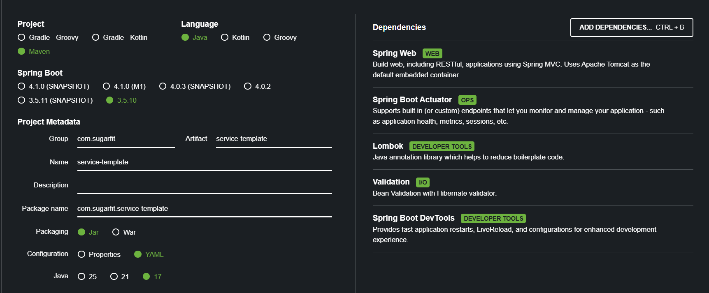

# Problem Statement:

Create a Java Spring Boot service that can act as a base template for future services in our organization.
Assume this service will:
1. Be deployed to a high-traffic production environment.
2. Be maintained by multiple engineers.
3. Serve as the standard for how we build microservices.

# Pre-requisites:
To run the project you need:
1. JDK 17 installed and setup properly in environment variables
   (I used Adoptium JDK 17 : https://adoptium.net/en-GB/temurin/releases?version=17&os=any&arch=any)
2. Maven
   ( In case you don't have this run the mvnw or mvnw.cmd type commands from below steps.)
3. Optional IntelliJ (To debug or to view the code easily)
4. Optional Lombok plugin from the intellij plugin store.

# Project Setup:

Clone the repository by using

`git clone https://github.com/fadebeyond/service-template.git`

then go into the correct directory

`cd service-template`

Post installation:

Windows

`mvnw.cmd clean test`

Mac / Linux

`./mvnw clean test` / `mvn clean test`

if all tests pass then your project is ready to run.

Then run

`mvnw.cmd spring-boot:run` / `mvn spring-boot:run`

# About the Project

1. Project Configurations:
- Java 17: Most commonly used and easy to find documentation version. Easier to migrate from as compared to older versions
- Maven: My preference because have worked extensively with maven.
- Packaging: JAR because WARs are too old and bulky.
2. Dependencies:
- Spring WEB: Default for REST Client.
- Spring Boot Actuator: For the asked /health endpoint.
- Lombok: No brainer for annotation.
- Validation: TO validate request objects.

# Assumptions
1. No persistence layer was added since the assignment did not require data storage and the focus was on API design and infrastructure concerns.

2. Minimal business logic was implemented to keep the service lightweight and focused on request handling, validation, and error mapping.

3. Limited test coverage was intentional current tests focus on API contracts rather than trivial unit tests with no complex business logic to test.

4. Security and authentication were omitted to keep the scope aligned with the assignment and time constraints.

5. Explicit /health endpoint was skipped intentionally as I used spring actuator which has this in built.

# Design Decisions:

1. Layered package structure (controller, service, model, exception, config) was chosen to keep responsibilities clearly separated and make the codebase easy to extend as the service grows.

2. A standard API response wrapper (ApiResponse) is used to ensure consistent response formats across success and error cases.

3. Global exception handling (@RestControllerAdvice) centralizes error handling logic, avoids duplication, and ensures correct HTTP semantics (4xx vs 5xx).

4. Request ID propagation via filters and MDC was added to support traceability and observability, which is critical in production backend systems.

5. Default Spring Boot configuration was retained to keep the service lightweight and avoid introducing configuration without a concrete requirement.

6. Spring Boot Actuator is used for health checks instead of a custom endpoint to leverage built-in, production-ready functionality.

# Future Roadmap
If this were a long-term production service, the following enhancements would be prioritized:

1. Add authentication and authorization (e.g., JWT / OAuth2).

2. Add DB layer for services that might need it with default configs for cache and DB connections.

3. Expand health checks to include external dependencies (DB, cache).

4. Add structured logging and metrics (Micrometer + Prometheus) with more metrics.

5. Add more unit test cases.

### **Postman Testing Collection:**
Use the below as a reference to test endpoints.
https://www.postman.com/science-pilot-48828106/sugar-fit-assignment/collection/21669106-f33b61ca-4130-4d71-a24d-a6e6c631c8d1/?action=share&creator=21669106